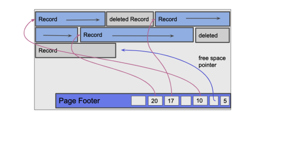

### Contributors
- Pablo Deputter
- Robin Dillen
- Gaia Colombo

We developed an unordered heap file to manage variable-length records, with each data page having a size of 4KB. To organize the data pages, we utilized a linked list of page directories, indicating which pages are full.

### Data Pages & Directories

We choose to have a footer instead of a header to store our number of slots and free space pointer. 
This has no particular reason, Pablo just decided this.



Both data pages and directories have a similar footer:

- **Number of Slots**: 2 bytes
- **Free Space Pointer**: 2 bytes, indicates where new data can be written

Each slot in the footer has:

- **Offset**: 2 bytes, pointing to the start of the record
- **Length**: 2 bytes, size of the record
- **Total Slot Size**: 4 bytes

However, data pages and directories differ in what they store:

- **Data Pages**: Variable-length records
- **Directories**: Fixed-size (6 bytes) records, storing the data page number (3 bytes) and available space (3 bytes)
  
The first slot in a directory also contains meta-info like its own number and a pointer to the next page directory, which is actually just the number of the next directory. This is handy to calculate the relative number of a data page inside the directory.

### Utilities

In `utils.py`, we implemented utility methods to handle encoding and decoding records based on a given schema. 
```python
# Example Schema and Record
schema = ['int', 'var_str', 'short', 'int', 'int', 'byte', 'var_str', 'var_str', 'var_str', 'var_str']
record = (1, "Alice", 23, 12345, 987654, 4, "alice@email.com", "1234567890", "ACME", "Elm St")
utils.encode_record(schema, record)
```

### CRUD Operations

- **Create**: When inserting a record, we first load the initial page directory to search for a data page with adequate free space. If no suitable page is found, a new data page is created in the first available directory slot. For the actual insertion, we write the record at the location indicated by the free space pointer, then update this pointer and the slot length in the footer. If a slot from a previously deleted record exists, indicated by a zero-length slot. We repurpose that slot for the new record and update its footer information.
- **Read**: To read a record we search all the pages for the record that has the corresponding id. We assume every record has an id as it's first element. If we don't find the record we just print 'not found' and return None
- **Update**: Updating a record is straightforward if its length remains unchanged; we simply overwrite the existing data. If the updated record is smaller, we overwrite it, update the slot length, and then compact the page to prevent fragmentation. If the new record is larger, the original is deleted and the updated record is re-inserted, potentially into a different data page.
- **Delete**: To delete a record, we set its slot length to zero and immediately compact the data page to prevent fragmentation. During this compaction, all remaining records are shifted to the left, effectively overwriting the deleted entry.

### Test & Optimizations

`test.py` includes methods to validate our implementation for all CRUD operations. We didn't implement indexing or compression due to time constraints and didn't know how we actually could store these compression maps in the database. Which leaves room for future optimizations.

### Performance

We tested our implementation on fake Users data for 10000 records on a empty database file. The results are as follows:
- **Inserts**: ~16 000 per second (empty database)
- **Reads**: ~1500 per second
- **Updates** ~2500 per second
- **Deletes**: ~3500 per second for 5000 records
- **Database Size**: 1204224b

We didn't use indexes for finding records, we just used a linear scan to look for the ID of a user, that's why reading is so slow. The total database is also around the same size in comparison to that of the exercises after compression techniques, but here we lose a lot of space alone to information that is used for the CRUD operations.


### References
[cs186berkeley - Disk & Files](https://cs186berkeley.net/fa20/resources/static/notes/n02-DisksFiles.pdf)
